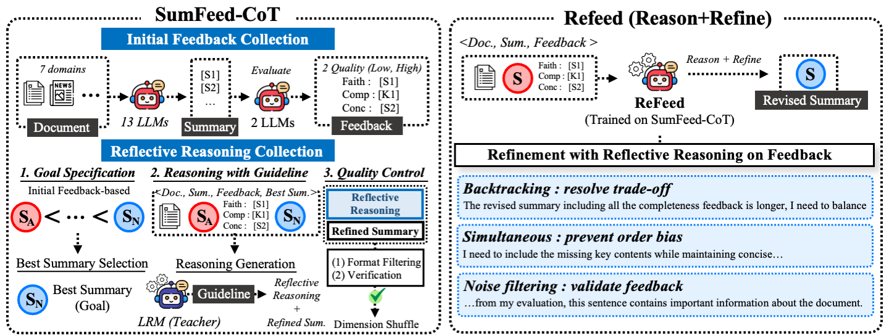
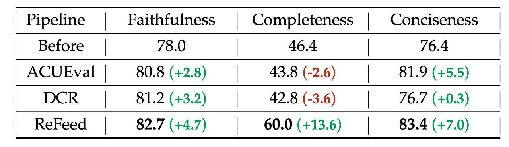

<h1 align="center">
♻️ ReFeed (COLM'25)
</h1>


<h3 align="center">
ReFeed: Multi-dimensional Summarization Refinement with Reflective Reasoning on Feedback
</h3>


<div align="center">
  <p>Authors: Taewon Yun, Jihwan Oh, Hyangsuk Min, Yuho Lee, Jihwan Bang, Jason Cai, Hwanjun Song</p>
  <a href="https://arxiv.org/abs/2503.21332">
  
  </a>
  <a href="https://disl-lab.github.io/">
  
  </a>

  
  

<p align="center">
  
</p>

</div>

> This is the official github repository for "ReFeed: Multi-dimensional Summarization Refinement with Reflective Reasoning on Feedback"

## 📄 Table of Contents
- [📌 Table of Contents](#-table-of-contents)
  - [Overview](#overview)
  - [Datasets](#datasets)
  - [Quick Start](#quick-start)
    - [Training Setup](#training-setup)
    - [Launch Training](#launch-training)
  - [Results](#evaluation)
  - [Citation](#citation)
  - [Acknowledgement](#acknowledgement)

## Overview


ReFeed rethinks summary refinement by showing that reflective reasoning over multi-dimensional feedback is key to achieving balanced, robust improvements. 

Our contributions:

* 🧠 **Introduces reflective reasoning for multi-dimensional refinement**, enabling models to resolve trade-offs, mitigate order bias, and filter noisy feedback simultaneously
* 🏗️ **Releases SumFeed-CoT**, a large-scale Long-CoT dataset that distills high-quality reflective reasoning from large reasoning models into lightweight models
* 🚀 **Demonstrates strong empirical gains and robustness**, achieving consistent improvements across faithfulness, completeness, and conciseness while remaining resilient to feedback quality and ordering

## 🤗 Datasets

| Dataset | Description | Link |
|---------|-------------|------|
| SumFeed-CoT | Training set for ReFeed (7713 samples) | [🤗](https://huggingface.co/datasets/DISLab/SumFeed-CoT) |

## 🛠️ Quick Start

### Training Setup

1. **Environment Setup**
   - Ensure all dependencies are properly installed and configured.

2. **Data Preparation**
   - Obtain the SumFeed-CoT dataset from [🤗 Hugging Face](https://huggingface.co/datasets/DISLab/SumFeed-CoT).

3. **Configuration**
   - Use our provided [configuration file](./configs/zero3.yaml).

### Launch Training

For training, use the following command:

```bash
sh ./script/sft.sh
```

## 📄 Results


<p align="center">
  
</p>

* 📈 **ReFeed achieves the best overall performance** across faithfulness, completeness, and conciseness, outperforming all previous refinement methods that optimize a single dimension.
* ⚖️ **Reflective reasoning enables balanced improvements**, effectively mitigating trade-offs that arise when optimizing multiple dimensions simultaneously.
* 🔀 **Strong robustness to feedback order and noise**, showing minimal performance variance under shuffled or low-quality feedback settings.
* 🧩 **Efficient distillation**: a lightweight 8B model matches teacher-level refinement quality while significantly reducing inference cost.

## 🖇️ Citation

Please consider citation if our paper is useful in your research.
```BibTeX
@inproceedings{yun2025refeed,
    title={ReFeed: Multi-dimensional Summarization Refinement with Reflective Reasoning on Feedback},
    author={Taewon Yun and Jihwan Oh and Hyangsuk Min and Yuho Lee and Jihwan Bang and Jason Cai and Hwanjun Song},
    booktitle={Second Conference on Language Modeling},
    year={2025},
    url={https://openreview.net/forum?id=6BGDGKZN7q}
}
```

## 🙏 Acknowledgement
This research was supported by KISTI, and by the NRF. For GPU infrastructure, our work was supported by the IITP grant funded by MSIT.

###### *This work was done @ KAIST Data Intelligence System Lab*